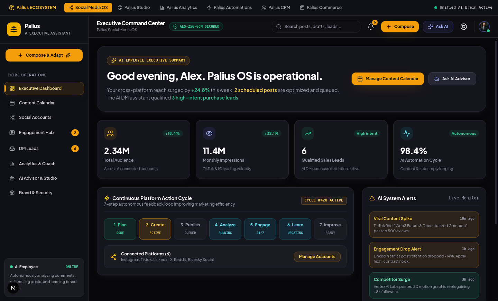
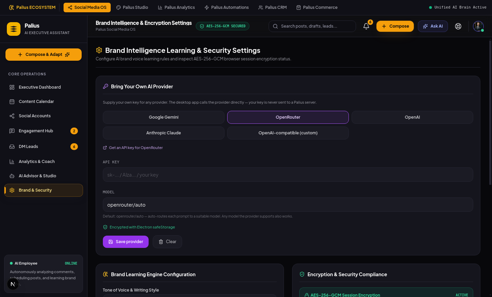

<div align="center">

<picture>
  <source media="(prefers-color-scheme: dark)" srcset="apps/frontend/public/palius-logo/svg/wordmark-color-dark.svg">
  <source media="(prefers-color-scheme: light)" srcset="apps/frontend/public/palius-logo/svg/wordmark-color-light.svg">
  
</picture>

### Run your entire social media presence from one dashboard.

**One upload, adapted and published everywhere it fits.**

<p>
  <a href="LICENSE"></a>
  
  
  
  
  
</p>



</div>

---

## What is Palius?

Palius is an **AI social media CRM** for people who do not have a marketing
team — solo developers, early startups, small agencies, creators and small
businesses.

Most social tools make you do the boring part twice: write the post, then
rewrite it five times because a LinkedIn post is not a TikTok caption is not an
X thread. Palius takes one upload and adapts it per platform, schedules it,
publishes it, replies to the comments, qualifies the DMs that look like leads,
and tells you what actually worked.

**It runs on your own AI key.** There is no hosted middleman charging you a
markup on tokens — you bring a Gemini, OpenRouter, OpenAI or Anthropic key (or
point it at a local model), and the app talks to that provider directly. In the
desktop app the key is encrypted at rest with the OS keyring.

### Why you might want it

| | |
|---|---|
| 🔑 **Bring your own key** | Your key, your provider, your bill. Nothing is proxied through a Palius server. Works with local and self-hosted models too. |
| 🖥️ **Real desktop app** | Linux, macOS and Windows. Starts its own local server — no backend, no account, no round-trip to use the UI. |
| 🔌 **Connect without API approval** | Three levels: paste an API key, OAuth, or sign in through an embedded browser on the platform's own login page. The last needs no developer account. |
| ✍️ **Publishes where APIs don't exist** | Substack has no write API and Medium stopped issuing tokens. A signed-in browser session writes the post into the platform's own editor. |
| 🧩 **Extend it yourself** | Add any platform or blog destination via JSON API mapping or browser login. Stored in the database, live immediately, no redeploy. |
| 🔐 **Sessions sealed** | Captured sessions are encrypted with AES-256-GCM and re-checked rather than assumed valid. |

---

## Quick start

### Desktop app — the fastest way in

No backend, no database, no account. Build it and run it:

```bash
git clone https://github.com/Profy256/Palius.git
cd Palius

npm install --prefix apps/frontend
npm install --prefix apps/desktop

npm run dist:linux --prefix apps/desktop   # or dist:mac / dist:win
```

Then install the result:

```bash
# Linux
sudo dpkg -i apps/desktop/release/palius-os-desktop_1.0.0_amd64.deb

# macOS — open the .dmg and drag Palius to /Applications
# Windows — run "Palius Setup 1.0.0.exe"
```

| Platform | Command | Output |
|---|---|---|
| **Linux** | `npm run dist:linux` | `.AppImage` + `.deb` |
| **macOS** | `npm run dist:mac` | `.dmg` (Intel + Apple Silicon) — must build on macOS |
| **Windows** | `npm run dist:win` | NSIS `.exe` — best built on Windows |
| Current OS | `npm run dist` | whatever you are on |

> 📖 **Full desktop guide** — signing, notarization, installing without root,
> CI matrix and troubleshooting: **[apps/desktop/README.md](apps/desktop/README.md)**

### Add your AI key

Open **Settings → Brand & Security → Bring Your Own AI Provider**, pick a
provider, paste a key, save. That is the whole setup.

<div align="center">

</div>

| Provider | Default model | Get a key |
|---|---|---|
| Google Gemini | `gemini-2.0-flash` | [aistudio.google.com/apikey](https://aistudio.google.com/apikey) |
| **OpenRouter** | **`openrouter/auto`** | [openrouter.ai/keys](https://openrouter.ai/keys) |
| OpenAI | `gpt-4o-mini` | [platform.openai.com/api-keys](https://platform.openai.com/api-keys) |
| Anthropic Claude | `claude-3-5-sonnet-latest` | [console.anthropic.com](https://console.anthropic.com/settings/keys) |
| OpenAI-compatible | *you supply model + base URL* | any local or self-hosted endpoint |

OpenRouter defaults to its **auto-router** — paste a key and it picks a suitable
model per prompt, no model name needed. Any specific model still works if you
prefer to pin one.

Keys go straight from your machine to the provider. The desktop app encrypts
yours with Electron `safeStorage` (Keychain / DPAPI / libsecret); a browser
falls back to `localStorage`.

### Full platform — Docker

The desktop app is the frontend only. For the Go API, admin dashboard and
browser worker:

```bash
cp .env.example .env          # optional: add an AI key
docker compose up -d --build
```

| Service | URL |
|---------|-----|
| App | http://localhost:3000 |
| Admin | http://localhost:3001 |
| API | http://localhost:8080/api/v1 |

### Full platform — local dev

```bash
cd apps/backend  && go mod tidy && go run .    # :8080  (SQLite, zero setup)
cd apps/frontend && npm install && npm run dev # :3000
cd apps/admin    && npm install && npm run dev # :3001
cd apps/worker   && npm install && npm start   # :8090  (optional)
```

Without an AI key the backend serves deterministic fallback data, so the whole
UI works on a clean checkout. The worker is optional in the same spirit: skip it
and the connect dialog reports browser login as unavailable and says why, rather
than offering a button that fails.

> ⚠️ **The backend does not read `.env` files.** There is no `godotenv`
> dependency, so a bare `go run .` starts with *zero* configuration regardless
> of what `apps/backend/.env` contains. Export variables explicitly, or use
> Docker, where compose passes them in.

---

## Features

- **TikTok-style create flow** — upload media and prompt conversationally; add a
  website URL for digital products or product context (PDF/DOC/MD/photos). The AI
  asks when it lacks context instead of guessing.
- **Content calendar** with per-platform scheduling and an AI analyzer drawer
- **Repurposing engine** — one post becomes a TikTok script, a LinkedIn article,
  an X thread, each tailored rather than copy-pasted
- **Engagement hub** — comment auto-reply against a knowledge base you control
- **DM lead qualification** — inbound DMs scored and routed as sales leads
- **Analytics & coach** — per-platform metrics, competitor tracking, performance
  coaching
- **Viral research** — content ideas, posting styles and virality tactics per
  platform
- **AI image & video generation** with a cost-scored model catalog; exploration
  routes to cheap models, finals to premium
- **Blog publishing** — dev.to, Hashnode, LinkedIn, Reddit, Medium, own site,
  plus a Product Hunt launch kit. An unconfigured destination returns a formatted
  export instead of failing.
- **Admin dashboard** — MRR, per-model spend, per-customer profitability, live
  operations and alerts
- **Credits model** — the subscription covers the platform; only image and video
  generation is metered. Captions, hooks, publishing, analysis, auto-reply and
  scheduling stay unmetered, because metering cheap operations teaches people to
  be afraid of the product.

---

## Architecture

```
┌──────────────┐   ┌──────────────┐   ┌──────────────┐
│   Desktop    │   │  Frontend    │   │    Admin     │
│  (Electron)  │   │  (Next.js)   │   │  (Next.js)   │
└──────┬───────┘   └──────┬───────┘   └──────┬───────┘
       │ bundles the      │                  │
       │ same frontend    │                  │
       └──────────────────┼──────────────────┘
                          ▼
                 ┌──────────────────┐
                 │  Backend (Go)    │
                 │  AI · cost engine│
                 │  metering · pub  │
                 └────────┬─────────┘
                          │
              ┌───────────┴───────────┐
              ▼                       ▼
      ┌───────────────┐      ┌────────────────┐
      │ Postgres /    │      │ Worker (Node)  │
      │ SQLite        │      │ Playwright     │
      │ sessions AES  │      │ browser login  │
      └───────────────┘      └────────────────┘
```

The desktop app is **the same frontend build** as the web app — one codebase,
one design system. It runs Next's `standalone` server locally on a free port,
which is why it needs no backend to render the UI.

### Repository layout

| App | Path | Stack | Local port |
|-----|------|-------|------|
| **Frontend** | `apps/frontend/` | Next.js 15 (App Router), React 19, Tailwind | 3000 |
| **Backend** | `apps/backend/` | Go 1.25 + Gin, Postgres/SQLite | 8080 |
| **Admin** | `apps/admin/` | Next.js 15, standalone operator dashboard | 3001 |
| **Worker** | `apps/worker/` | Node 20 + Playwright, embedded browser login | 8090 |
| **Desktop** | `apps/desktop/` | Electron wrapper for the frontend | free port |

```
apps/
  frontend/   # Dashboard, create flow, calendar, social hub, AI hub, analytics
  backend/    # AI, cost engine, credit metering, publishing, admin monitoring
  admin/      # Business health, model spend, customer profitability, rate card
  worker/     # Level 3 connectors: sign in to platforms through a real browser
  desktop/    # Electron desktop app — see apps/desktop/README.md
PRD.md            # Product requirements (v1.2)
architecture.md   # System architecture
srs.md            # Software requirements specification
technical.md      # Technical document (v2.0)
DEPLOYMENT.md     # Vercel + Render + Neon
```

---

## Versions

Verified against what is actually installed, not the semver ranges in
`package.json`.

| App | Version | Stack |
|---|---|---|
| **Desktop** | 1.0.0 | Electron 33.4.11 · Chromium 130.0.6723.191 · Node 20.18.3 (bundled) · electron-builder 25.1.8 |
| **Frontend / web** | 1.0.0 | Next.js 15.5.22 · React 19.2.8 · Tailwind 3.4.19 · TypeScript 5.8.3 |
| **Backend** | — | Go 1.25.0 + Gin |
| **Admin** | 0.1.0 | Next.js 15.1 · React 19 |
| **Worker** | 0.1.0 | Node ≥ 20 · Playwright 1.50.0 · ws 8.18.0 |

Frontend libraries: lucide-react 0.546.0 · motion 12.42.2 · @vercel/analytics 2.0.1

---

## Configuration

Set `AI_PROVIDER=auto` and any one key — Gemini, OpenAI, Anthropic, DeepSeek,
OpenRouter, or an Ollama / OpenAI-compatible endpoint.

Production also wants:

```env
DATABASE_URL=postgresql://...   # Neon pooled string; SQLite is used if unset
APP_ENV=production
ALLOWED_ORIGINS=https://app.example.com,https://admin.example.com
ADMIN_TOKEN=                    # guards /api/v1/admin/*
PALIUS_SECRET_KEY=              # AES-256-GCM key for stored credentials.
                                # Unset = the server refuses to store any
                                # credential rather than write plaintext.
PALIUS_RATE_CARD=/path/to.json  # optional vendor-price override, no redeploy

# Level 3 browser login (apps/worker)
PLAYWRIGHT_WORKER_URL=          # where the API reaches the worker
PLAYWRIGHT_WORKER_TOKEN=        # shared secret; matches the worker's WORKER_TOKEN
PLAYWRIGHT_WORKER_PUBLIC_URL=   # where the USER'S BROWSER reaches it, if different
```

Optional blog destinations — an unconfigured one returns a formatted export
instead of failing: `DEVTO_API_KEY`, `HASHNODE_API_KEY` +
`HASHNODE_PUBLICATION_ID`, `LINKEDIN_ACCESS_TOKEN` + `LINKEDIN_AUTHOR_URN`,
`REDDIT_ACCESS_TOKEN`, `MEDIUM_TOKEN` + `MEDIUM_USER_ID`, `PRODUCTHUNT_TOKEN`,
`OWN_SITE_WEBHOOK_URL`.

### Admin token

`ADMIN_TOKEN` guards every `/api/v1/admin/*` endpoint — customer data, spend,
plan changes, refunds and exports. **You generate it yourself; there is no
vendor to obtain it from.** It is a password that is only secret because nobody
else knows it:

```bash
openssl rand -base64 32
```

It is deliberately **not** a `NEXT_PUBLIC_*` variable: those are inlined into
the JavaScript that ships to the browser, which would publish the key to anyone
who can load the page. Leaving it unset keeps the admin API open in development
and makes it **refuse every request** when `APP_ENV=production`.

`NEXT_PUBLIC_PALIUS_USER_ID` is not a credential and grants nothing — it is just
the account id the apps attribute usage to, and the backend does not verify it.

---

## Development

```bash
cd apps/backend  && go build ./... && go vet ./... && go test ./...
cd apps/frontend && npm run lint && npm run build
cd apps/admin    && npm run lint && npm run build
cd apps/worker   && npm run check
```

Deployment: Vercel (frontend + admin) · Render (Go API) · Neon (Postgres).
See **[DEPLOYMENT.md](DEPLOYMENT.md)**.

---

## Project status

**Not production-ready — and honest about it.** Two blockers before this can
hold real users:

1. **No end-user authentication.** `userId()` reads an unverified `X-User-Id`
   header — anyone can act as any user.
2. **No multi-tenancy.** No organisations, roles or seat enforcement, despite
   plans selling 3/10/50 seats.

Also not yet built: Redis job queue (so no scheduled publishing yet), media
object storage, payment provider. See the Build Status section of `PRD.md`.

The **desktop app and the UI are usable today** with your own AI key — that path
does not touch the incomplete backend.

---

## Contributing

Contributions are welcome — issues, bug reports and pull requests.

1. Fork the repo and create a branch off `main`
2. Make your change; keep it in the style of the surrounding code
3. Run the verification commands above — they must pass
4. Open a pull request describing what changed and why

Good first areas: additional platform connectors, blog destinations, AI provider
integrations, and accessibility fixes.

---

## Author

Built by **Kafeero Proferious** — Bachelor of Software Engineering student at
**Kampala International University**, Uganda.

---

## License

Released under the [MIT License](LICENSE) — free to use, modify, distribute and
sell, commercially or otherwise, with attribution.
